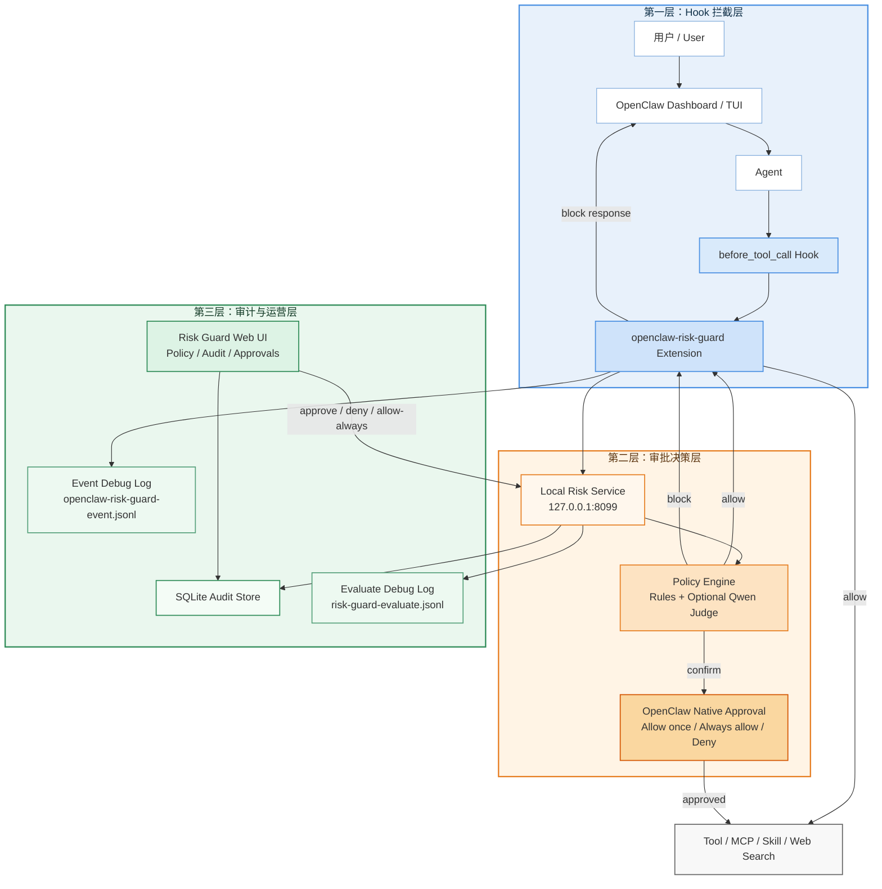

# 给 AI Agent 加一道“安全刹车”：我们是怎么给 OpenClaw 做本地风险网关的

大模型 Agent 正在快速从“会回答问题”走向“会调用工具、会修改环境、会连接外部系统”。这件事的价值毋庸置疑，但与此同时，一个非常现实的问题也随之出现了：**如果 Agent 已经可以代表用户执行命令、读写文件、调用 MCP、发起外部搜索甚至触发支付，那么我们应该把安全控制放在哪里？**

很多团队在这个阶段的第一反应，是从模型提示词、权限开关或者工具白名单入手。这些手段当然有价值，但当 Agent 开始进入“运行时决策”阶段，仅靠静态配置往往不够。真正的问题不再是“某个工具能不能被暴露给模型”，而是：

- 这一次调用到底要做什么？
- 这是不是一次高风险副作用操作？
- 它会不会把隐私、秘钥或者上下文发到外部？
- 如果风险存在，系统能不能在用户确认之后再继续？

最近我们围绕 OpenClaw 做了一次本地安全网关的实现。这个项目本身并不复杂，但实现过程中暴露出来的几个关键认知，我认为对今天任何正在做 Agent 工程落地的团队，都有参考意义。

## 问题并不在“工具权限”，而在“运行时语义”

如果我们只从权限模型理解 Agent 安全，那么很容易得到一个看起来合理但实际上不够用的方案：

- 禁掉高危工具
- 给危险工具加审批
- 给只读工具默认放行

这个思路的问题在于，它仍然把风险理解成“工具类型本身的风险”，而不是“这一次调用在当前上下文里的风险”。

以 `web_search` 为例，它在很多系统里都会被视为低风险只读操作。但只要把 query 换成客户隐私、内部代号、账号信息、秘钥片段，它的风险性质就会完全不同。再比如同样是 `exec`，`df -h` 和 `rm -rf` 根本不是一个风险等级。对外发送消息也是一样，发送一个会议提醒和发送一段包含凭据的运维日志，不可能用同一个策略处理。

所以从一开始，我们就没有把目标定义成“做一个工具白名单”，而是定义成一条完整的**运行时安全决策链**：

1. 在工具调用前拦截
2. 获取这次调用的运行时上下文
3. 对风险做分级
4. 决定 `allow / confirm / block`
5. 把过程写入审计

换句话说，这更像是在 Agent 运行时引入一层轻量的 threat modeling，而不是简单的权限判断。

## 架构上，最合适的位置是 `before_tool_call`

OpenClaw 的一个关键能力，是允许插件在 `before_tool_call` 阶段接管工具调用。这个位置非常重要，因为它既足够靠前，可以阻止危险操作真正发生；又足够靠近执行层，可以拿到运行时参数，而不仅仅是模型最终生成的一段文本。

我们最终采用的架构很简单：

1. OpenClaw 扩展在 `before_tool_call` 里拦截请求
2. 扩展把工具名、参数、来源和事件摘要发给本地风险服务
3. 本地风险服务用规则引擎做第一层判定
4. 如有需要，再用千问兼容接口做第二层语义判定
5. 服务返回三态结果：
   - `allow`
   - `confirm`
   - `block`
6. OpenClaw 根据结果执行放行、原生审批或阻断

这个模式有一个很大的好处：**安全控制不再散落在提示词、前端、工具实现和日志系统里，而是收敛成一个独立的运行时治理面。**

如果把整个方案压缩成一张图，大概会是这样：

## 真正难的地方，不是写规则，而是搞清楚事件真实长什么样

从实现工作量上看，做一个本地 HTTP 服务并不难，做一个策略引擎也不难。真正花时间的部分，是把 OpenClaw 事件结构摸清楚。

我们在最开始遇到的现象是：

- 审计记录经常是空的
- `tool_name` 是空字符串
- `source` 变成 `unknown`
- `user_prompt` 为空
- `raw_event` 也是空对象

如果只看数据库，很容易怀疑是插件没加载、服务没重启，或者存储逻辑有问题。但这些猜测都不够精确。后来我们专门加了两类调试日志：

- 一份记录 OpenClaw 扩展在 `before_tool_call` 收到的原始事件
- 一份记录风险服务在 `/v1/evaluate` 实际收到的 HTTP 请求

这一步带来的价值非常大。它让我们第一次真正看清楚：

- `before_tool_call` 并不总能拿到完整的用户输入
- 某些场景里事件里只有 `toolName`、`params`、`runId` 和 `toolCallId`
- 更关键的是，插件发往 Python 服务的请求体一度被服务端读成了空对象

这其实是一个非常典型的 Agent 工程问题：**你以为你在调策略，实际上你在调运行时协议细节。**
## 审批这件事，本质上不是“能不能弹窗”，而是“用户能不能做出判断”

当审批链第一次在 Dashboard 里真正弹出来时，我们很快又发现了第二个问题：**弹框本身并不清楚。**

最开始的审批文案是这种风格：

- 高风险工具调用待确认
- 该操作存在潜在风险，需要你明确确认后才能继续

从安全角度说，这样的文案没有错；但从工程可用性说，它远远不够。因为它没有回答用户真正关心的三个问题：

1. 这次到底要执行什么？
2. 为什么它被判成风险？
3. 我点 `Allow once` 和 `Always allow` 之后分别意味着什么？

所以后来我们把审批文案做成了按工具类型定制。比如：

- `web_search` 直接显示 query
- `exec` 直接显示即将执行的命令摘要
- `sessions_send` 显示待发送内容的前几行摘要

下面这张图，是当前审批弹框的一个实际效果。它比最初的版本已经清楚很多，至少用户能直接看到“即将执行什么”和“为什么需要确认”。

我认为这一点很重要。安全审批如果不能支持“可决策”，最后要么沦为纯形式，要么把用户训练成无脑点通过。对 Agent 系统来说，审批不是为了让系统显得更谨慎，而是为了让用户在最小成本下做出正确判断。

进一步往下想，这其实会把问题推到另一个经常被低估的层面：**审批流的 UI 通道本身，就是安全设计的一部分。**

很多团队做 Agent 审批时，默认会把注意力放在策略和规则上，却很少认真讨论“审批到底应该在哪个 channel 里发生”。但现实是，不同 channel 对审批这件事的支持能力差异非常大，而这件事会直接影响安全控制是否真的可用。

如果简单做一轮横向比较，大致会得到这样一个结论：

- **Web 控制台 / Dashboard：支持度最高。**  
  这类界面天然适合做审批，因为它能承载足够完整的上下文：工具名、参数摘要、风险原因、按钮语义、超时状态、审批历史、甚至后续审计。这也是为什么我们最后把 OpenClaw Dashboard 作为主审批入口。

- **Slack：支持度高。**  
  Slack 的 Block Kit 原生支持按钮、交互回调、按钮样式以及确认对话框，完全可以做出结构化审批卡片。[Slack Block Kit](https://api.slack.com/block-kit) [Button element](https://api.slack.com/block-kit/block-elements)

- **Microsoft Teams：支持度高。**  
  Teams 的 Adaptive Cards 支持 `Action.Execute`、`Action.Submit` 等交互动作，也非常适合做企业内审批流，尤其是表单型和多步骤确认。[Executing Actions](https://learn.microsoft.com/en-us/microsoftteams/platform/teams-ai-library/in-depth-guides/adaptive-cards/executing-actions) [Action.Submit](https://learn.microsoft.com/en-us/adaptive-cards/schema-explorer/action-submit)

- **Discord：支持度中高。**  
  Discord 的 Message Components 支持按钮、选择器和交互回调，能承载轻量审批，但更偏社区型产品场景，企业治理语境下通常不是首选。[Discord Components](https://docs.discord.com/developers/components/using-message-components) [Component Reference](https://docs.discord.com/developers/docs/interactions/message-components%2A)

- **Telegram：支持度中等。**  
  Telegram Bot API 的 Inline Keyboard 和 `CallbackQuery` 足够支持“批准 / 拒绝”这种二元审批，但它更适合轻量操作确认，不太适合承载复杂上下文、企业身份绑定和细粒度授权。[Telegram Bot API](https://core.telegram.org/bots/api/?v=1) [Bot API 2.0: Inline Keyboards](https://core.telegram.org/bots/2-0-intro)

- **macOS 系统通知：更适合作为提醒，不适合作为主审批界面。**  
  从系统能力上讲，Apple 的 UserNotifications 确实支持 actionable notifications，甚至支持自定义 action 和文本输入；但这通常要求原生应用配合。单靠脚本或轻量服务能做的更多是“提醒你有待审批请求”，而不是承载完整审批体验。[Handling notifications and notification-related actions](https://developer.apple.com/documentation/usernotifications/handling-notifications-and-notification-related-actions?changes=_2) [UNTextInputNotificationAction](https://developer.apple.com/documentation/usernotifications/untextinputnotificationaction)

- **Email：支持度低。**  
  邮件适合做异步告警，不适合做实时审批。原因不是它不能放按钮，而是审批真正需要的实时状态、撤销、超时、身份绑定和结果回写，在邮件里都很弱。

这个比较带来的一个直接结论是：**审批流不应该只追求“到处都能提醒”，而应该区分“提醒通道”和“决策通道”。**

我们后来把系统设计成“双层”：

- Dashboard 作为主审批入口
- macOS 通知作为辅助提醒入口

这样做的原因非常朴素：

- 用户需要被及时提醒
- 但真正做决策时，又必须看到足够完整的上下文

这件事反过来也给出了一些很实用的 UI 设计原则。

### 审批流 UI 的几个关键设计原则

**第一，审批卡片必须展示“动作摘要”，而不是只展示“风险摘要”。**  
用户真正想知道的是“系统到底准备做什么”，而不是“系统为什么觉得这件事危险”。两者都重要，但顺序必须反过来。先告诉用户即将执行什么，再告诉用户风险原因。

**第二，按钮语义必须是结果导向的。**  
`Allow once`、`Always allow`、`Deny` 之所以好，是因为它们直接对应不同的治理语义。如果把按钮写成“确认 / 取消”，用户其实并不知道确认之后系统会做什么。

**第三，要把审批流看成状态机，而不是一个弹窗。**  
一个成熟的审批流至少应该有：

- `pending`
- `approved once`
- `approved always`
- `denied`
- `timeout`
- `cancelled`

没有状态机，就很难做审计，也很难解释“为什么这次没有继续执行”。

**第四，提醒和审批可以分层，但审计必须统一。**  
无论用户是在 Dashboard 里点了批准，还是通过别的 channel 先收到提醒，最后都应该回到一套统一的审批记录和审计数据上。

从这个角度看，审批 UI 其实不是“风控做完之后补的前端”，而是风控系统本身的一部分。一个不能让用户快速理解和判断的审批界面，本质上就是不完整的安全设计。

## “误报”不是策略问题，而是领域建模问题

另一个很有意思的例子，是我们后来发现创建 reminder 居然会命中支付风险。原因看上去很荒谬，但又非常典型：提醒内容里包含了 `pay rent tomorrow`，而我们的 `payment_risk` 最开始是用简单的关键词匹配实现的，只要文本里出现 `pay`、`order`、`payment` 之类的词就会命中。

这件事让我再次意识到，Agent 安全策略本质上不是一堆 if-else，而是一种轻量的领域建模。

如果我们不了解业务语义，就会把“提醒我去付款”和“帮我直接付款”混为一谈。它们虽然表面上都包含 `pay`，但本质上一个是低风险意图表达，一个是真实交易行为。后来我们对这类规则做了更强的语义收紧：

- 如果工具名本身就是支付类，继续高敏命中
- 如果只是普通工具，则要求金额、币种、订单号等更强支付信号同时出现

这样一来，提醒不再误报，而真正的支付、下单、转账仍然会进入确认。

这类经验非常值得推广：**Agent 风控的核心挑战，不在于“能不能匹配关键词”，而在于“能不能把风险规则建立在正确的业务语义之上”。**

## 最终落地的，不只是一个拦截器，而是一条可审计的安全决策链

到这个阶段，我们的系统已经不只是一个“能拦截危险工具”的小插件，而是逐渐形成了一条比较完整的安全决策链：

- 工具调用前置拦截
- 本地规则引擎
- 可选模型语义二判
- 原生审批
- Web 审计台
- macOS 通知
- 审批历史和长期授权
- 事件摘要和运行时 trace

这条链真正有价值的地方，不是“能不能挡住一次危险调用”，而是它开始让 Agent 的行为变得：

- 可解释
- 可追溯
- 可审计
- 可运营
- 可持续演进

对企业场景来说，这一点非常关键。因为 Agent 一旦进入生产环境，安全问题很少是单一的“攻防问题”，更多时候是治理问题、责任边界问题、以及组织能否长期运维的问题。

## 这类系统下一步最值得做的，不是更复杂，而是更贴近真实外发路径

如果继续往前走，我认为最值得做的增强不是“再多加几十条规则”，而是把注意力放到外发路径上。比如：

- 对 `web_search`、消息发送、Webhook、邮件等外发类工具增加隐私评估
- 在外发前引入本地脱敏能力
- 对批准后的高风险请求支持重放或继续执行
- 对不同来源的工具调用做更精细的 namespace / source / session 级策略分层

尤其是隐私脱敏这一层，我认为很可能会成为 Agent 安全治理的下一个关键能力。因为很多风险并不在“这个工具是不是危险”，而在“模型是不是把不该发出去的内容发出去了”。

## 小结

回过头看，这次工作的最大收获，并不是“我们给 OpenClaw 加了一层风控”，而是更明确地认识到：**Agent 安全的真正对象，不是模型本身，而是模型驱动下的运行时行为。**

只要 Agent 开始拥有调用工具、修改环境、连接外部系统的能力，那么它就不再只是一个语言接口，而是一个运行时执行体。对这样的系统，真正有效的安全控制一定是运行时的、语义化的、可审计的，而不是只停留在提示词和静态配置层面。

在这个意义上，我们这次做的并不是一个简单的审批插件，而是一条针对 Agent 时代的最小安全控制面。

它不完美，但它至少把一个重要问题摆到了台面上：当 AI 开始替我们执行动作时，我们是否已经准备好在动作发生之前，给它踩一脚刹车？

## 参考
- RiskOps 本文代码库：
- OpenClaw Hooks 与插件机制：[docs.openclaw.ai](https://docs.openclaw.ai/)
