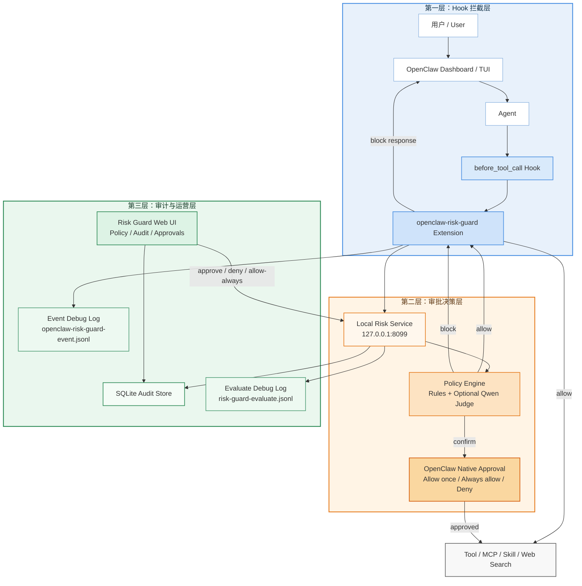

# OpenClaw Risk Guard

本项目是一个本地可运行的 OpenClaw 网关安全层，用来在工具调用前做风险判定、阻断、用户确权和审计。

它重点解决这些问题：

- Prompt 注入、绕过审批、索要系统提示词
- MCP / skill 的非只读敏感操作
- 命令执行、文件写入、数据库写操作、部署变更
- 支付、下单、转账、外发消息、Webhook 同步
- 秘钥、密码、Token、`.env`、SSH 凭据等敏感信息读取或泄露
- 外部搜索这类会把查询内容发到外部服务的请求

## 当前能力

- OpenClaw `before_tool_call` Hook 前置拦截
- 本地风险服务三态决策：`allow / confirm / block`
- Dashboard 原生审批联动
- 本地审计与调试 Web UI：`http://127.0.0.1:8099/`
- 审批历史、待确认列表、在线策略编辑
- 命中 `confirm` 时的 macOS 桌面通知
- 审计记录中的 `runId / toolCallId / raw_event` 调试摘要
- 可选接入阿里云 PAI / 千问兼容接口做语义二判

## 架构



1. OpenClaw 在 `before_tool_call` 阶段调用本地扩展 [index.ts](/Users/fanjiang/Documents/riskops/.openclaw/extensions/openclaw-risk-guard/index.ts)。
2. 扩展把工具名、参数、来源和事件摘要发给本地风险服务。
3. 风险服务 [server.py](/Users/fanjiang/Documents/riskops/risk_guard/server.py) 调用策略引擎 [policy.py](/Users/fanjiang/Documents/riskops/risk_guard/policy.py) 做规则判定。
4. 如果配置了千问兼容接口，再叠加一次模型语义判断。
5. 服务返回：
   - `allow`：直接放行
   - `confirm`：进入 OpenClaw 原生审批，并写入待审批记录
   - `block`：直接阻断
6. 审计和审批状态写入 SQLite：[risk_guard.db](/Users/fanjiang/Documents/riskops/data/risk_guard.db)

## 目录

- [main.py](/Users/fanjiang/Documents/riskops/main.py)
- [risk_guard/server.py](/Users/fanjiang/Documents/riskops/risk_guard/server.py)
- [risk_guard/policy.py](/Users/fanjiang/Documents/riskops/risk_guard/policy.py)
- [risk_guard/store.py](/Users/fanjiang/Documents/riskops/risk_guard/store.py)
- [risk_guard/pai_client.py](/Users/fanjiang/Documents/riskops/risk_guard/pai_client.py)
- [config/policy.json](/Users/fanjiang/Documents/riskops/config/policy.json)
- [.openclaw/extensions/openclaw-risk-guard/index.ts](/Users/fanjiang/Documents/riskops/.openclaw/extensions/openclaw-risk-guard/index.ts)
- [ui/index.html](/Users/fanjiang/Documents/riskops/ui/index.html)
- [ui/index.js](/Users/fanjiang/Documents/riskops/ui/index.js)
- [ui/index.css](/Users/fanjiang/Documents/riskops/ui/index.css)

## 本地启动

```bash
cp .env.example .env
python3 main.py
```

默认监听：

```text
http://127.0.0.1:8099
```

健康检查：

```bash
curl http://127.0.0.1:8099/health
```

## OpenClaw 接入

OpenClaw 配置文件路径：

- [~/.openclaw/openclaw.json](/Users/fanjiang/.openclaw/openclaw.json)

扩展目录：

- [.openclaw/extensions/openclaw-risk-guard](/Users/fanjiang/Documents/riskops/.openclaw/extensions/openclaw-risk-guard)

关键配置项：

- `baseUrl`：风险服务地址，默认 `http://127.0.0.1:8099`
- `requestTimeoutMs`：风险判定与回写超时
- `approvalTimeoutMs`：审批等待超时
- `approvalTimeoutBehavior`：超时处理，默认 `deny`
- `failOpen`：风险服务不可用时是否放行，默认 `false`

重启 OpenClaw / Gateway 后，Dashboard 中会出现原生审批弹框。

审批弹框示意：


## 风险判定接口

### 评估

```bash
curl -X POST http://127.0.0.1:8099/v1/evaluate \
  -H 'content-type: application/json' \
  -d '{
    "tool_name": "web_search",
    "source": "tool",
    "params": {"query": "常州 新闻"},
    "user_prompt": "请搜索最近常州的新闻"
  }'
```

### 审批回写

```bash
curl -X POST http://127.0.0.1:8099/v1/confirm \
  -H 'content-type: application/json' \
  -d '{
    "confirmation_id": "YOUR_ID",
    "decision": "allow-once"
  }'
```

支持的 `decision`：

- `allow-once`
- `allow-always`
- `deny`

## 调试与审计 UI

服务启动后，打开：

- [http://127.0.0.1:8099/](http://127.0.0.1:8099/)

这个页面提供：

- 在线查看和修改策略
- 手工构造一次工具调用做判定
- 查看最近的 `allow / confirm / block`
- 查看 `pending / allow-once / allow-always / deny / cancelled`
- 对 `pending` 记录执行“批准一次 / 总是允许 / 拒绝”

对应接口：

- `GET /v1/policy`
- `POST /v1/policy`
- `GET /v1/audit`
- `GET /v1/approvals`
- `POST /v1/confirm`

## 调试日志

为了定位 OpenClaw 事件结构和服务入参，当前会额外写两类调试日志：

- [/tmp/openclaw-risk-guard-event.jsonl](/tmp/openclaw-risk-guard-event.jsonl)
  - 记录扩展在 `before_tool_call` 收到的原始事件和归一化 payload
- [/tmp/risk-guard-evaluate.jsonl](/tmp/risk-guard-evaluate.jsonl)
  - 记录风险服务收到的 `/v1/evaluate` 原始请求

## 当前策略覆盖

当前 [config/policy.json](/Users/fanjiang/Documents/riskops/config/policy.json) 已覆盖这些确认或阻断场景：

- `web_search`
- `exec / shell / script / run`
- `write / edit / patch / delete`
- MCP 写操作
- skill 敏感副作用
- 对外发送、同步、消息投递
- 数据库写操作
- 部署、发布、重启、线上变更
- 支付、下单、转账
- 敏感信息读取
- 隐私或凭据暴露风险 `block`

## macOS 通知

当风险服务返回 `confirm` 时，服务会尝试调用 `osascript` 发 macOS 桌面通知。

对应实现：

- [risk_guard/server.py](/Users/fanjiang/Documents/riskops/risk_guard/server.py)

注意：

- 这依赖本机允许通知显示
- 如果系统通知不可用，不影响核心审批链，只是少了提醒

## 阿里云 PAI / 千问接入

如果你配置了兼容接口，风险服务可以在规则判定之外，再调用一个千问模型做二次语义判断。

环境变量见：

- [.env.example](/Users/fanjiang/Documents/riskops/.env.example)

关键项：

- `QWEN_BASE_URL`
- `QWEN_API_KEY`
- `QWEN_MODEL`

未配置时，系统只走本地规则引擎。

## PAI 蒸馏资产

已包含这些训练与部署辅助文件：

- [tools/pai_distillation/generate_dataset.py](/Users/fanjiang/Documents/riskops/tools/pai_distillation/generate_dataset.py)
- [examples/pai/security_judge_seeds.jsonl](/Users/fanjiang/Documents/riskops/examples/pai/security_judge_seeds.jsonl)
- [config/pai/distillation_job.template.json](/Users/fanjiang/Documents/riskops/config/pai/distillation_job.template.json)
- [config/pai/eas_openai_compatible.template.json](/Users/fanjiang/Documents/riskops/config/pai/eas_openai_compatible.template.json)

## 当前边界

- Dashboard 里的原生审批体验最好，TUI 对插件级审批支持不稳定。
- `before_tool_call` 并不总能拿到完整 `user_prompt`，所以 `web_search` 这类场景当前使用 `params.query` 作为展示回退。
- OpenClaw 的外部搜索源可能会遇到 DuckDuckGo bot-detection，这不是 Risk Guard 本身的问题。
- 当前 `confirm` 仍然依赖 OpenClaw 原生审批继续执行；`8099` 审批页更适合作为审计、调试和备份审批入口。

## 下一步建议

- 把普通低风险 `web_search` 调整为直接放行，只对敏感 query 确认
- 接入本地 `PrivateMask` 做外发前隐私评估和脱敏
- 对 `sessions_send`、Webhook、邮件、MCP 外发类能力增加更细粒度审批文案
